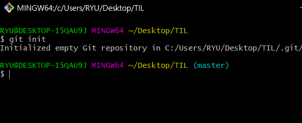

# GIT Command

> Git 명령어 정리

#### 0. init

- `git init`

- `.git/` 폴더를 생성 해준다.
- 
- `.git` 폴더가 생성된 경우 오른쪽에 `master` 라는 표시가 나온다.
- 최초에 한번만 하면 된다.

#### 1. add

- `git add <추가하고싶은 파일>` 
  - `git add .` : 현재 폴더의 모든 파일과 폴더를 add
- working directory => staging area로 파일 이동

#### 2. config

- `git config --global user.email "myemail@gmail.com"`
  - 이메일의 경우 깃허브에 올릴 경우 잔디가 심어지는 기준이므로 정확하게 입력!
- `git config --global user.name "myname"`
- 최초에 한번만 하면된다

#### 3. commit

- `git commit -m "메세지"`
- 스냅샷을 찍는 동작
- add 되어있는 파일들을 하나의 묶음으로 저장

- 메세지에 들어가는 내용은 기능 단위로 

#### 4. remote

- `git remote add origin <주소>`
- 원격 저장소와 현재 로컬 저장소를 연결하는 명령어

#### 5. push

- `git push origin master`
- 원격저장소에 로컬 저장소의 데이터를 전송
- 깃아 올려줘 origin으로 master를

#### 6. status

- `git status`

- 현재 git 상태를 출력

  

##### *추가

- 화면 캡쳐 = 윈도우 + shift + s    -> 캡쳐한 사진 그냥 ctrl + v하면 붙여넣어짐.

- 사진 넣기 설정 = 3번째 옵션 선택, 위에서부터 3개까지 박스 체크

- Typora 설치(주석 만들기)
- git 설치 (옵션 안건들여도 됨)