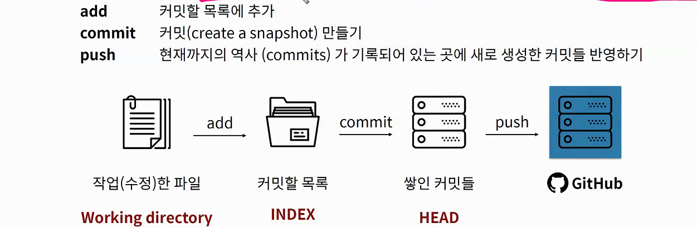

# Git

> 분산 버전 관리 시스템. 
>
> 코드의 히스토리를 관리하는 도구. 개발된 과정과 역사를 볼 수 있으며, 프로젝트의 이전 버전을 복원하고 변경사항을 비교, 분석 및 병합도 가능
>
> #SCM #DVCS #오픈소스

- 차이가 무엇이고, 수정 이유를 log로 남길 수 있다.
- 현재 파일들을 안전한 상태로 과거 모습 그대로 복원 가능. 각 버전별로 차이점만 저장해서 사이즈 감소

## 1.1 git의 작업 흐름

1. add : 커밋할 목록에 추가
2. commit : 커밋(create a snapshot) 만들기
3. push : 현재까지의 역사 (commits)가 기록되어 있는 곳에 새로 생성한 커밋들 반영하기.

## 1.2 git bash

