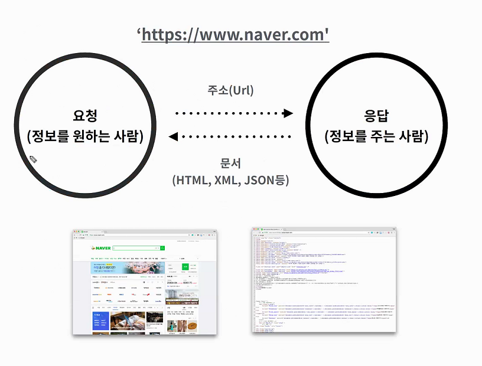
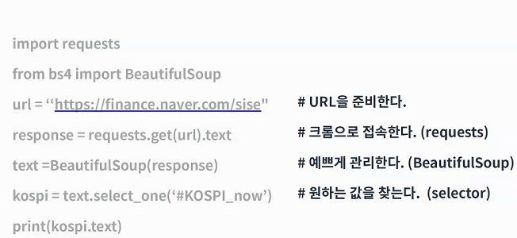
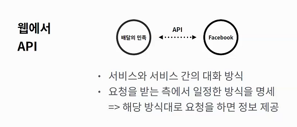
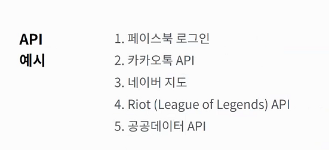

# API

>  다른 시스템간의 커뮤니케이션 방식.

- 웹에서의 api :  서비스와 서비스 간의 대화 방식..... 요청을 받는 측에서 일정한 방식을 명세 => 해당 방식대로 요청을 하면 정보 제공

JSON(JavaScript Object Notation) : 데이터만을 주고받기 위한 표기법. 파이썬의 딕셔너리와 리스트 구조로 쉽게 변환하여 활용할 수 있다.

